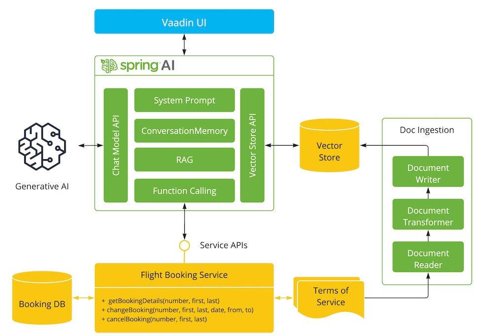

# 基于SpringAI实现的专家系统

项目参考了 https://github.com/marcushellberg/java-ai-playground

此应用展示了如何使用 [Spring AI](https://github.com/spring-projects/spring-ai) 构建一个 AI 驱动的系统：

- 可以访问条款和条件（检索增强生成，RAG）
- 可以访问工具（Java 方法）来执行操作（函数调用）
- 使用 LLM 与用户交互
- 可以访问数据库查询数据



## 环境要求

- Java 17+
- 在application.properties中配置api_key

## 启动

运行`Application.java`即可。

### 使用Open ai（需要购买及科学上网）

- pom中引入依赖:

```xml
<dependency>
    <groupId>org.springframework.ai</groupId>
    <artifactId>spring-ai-openai-spring-boot-starter</artifactId>
</dependency>
```

配置文件`applicaiton.properties`中填写api_key和选择的模型:

```
spring.ai.openai.api-key=${OPENAI_API_KEY}
spring.ai.openai.chat.options.model=gpt-4o
```

### 使用智普AI

- pom中有引入依赖：

  ```xml
  <dependency>
      <groupId>org.springframework.ai</groupId>
      <artifactId>spring-ai-starter-model-zhipuai</artifactId>
  </dependency>
  ```

- 添加智普AI的配置

  ```properties
  spring.ai.zhipuai.api-key=
  spring.ai.zhipuai.chat.options.model=glm-4-long
  ```

### 使用 VertexAI Gemini Chat

在 pom 中添加 Spring AI 的 VertexAI Gemini 和 ONNX 转换器依赖：

```xml
<dependency>
    <groupId>org.springframework.ai</groupId>
    <artifactId>spring-ai-vertex-ai-gemini-spring-boot-starter</artifactId>
</dependency>

<dependency>
    <groupId>org.springframework.ai</groupId>
    <artifactId>spring-ai-transformers-spring-boot-starter</artifactId>
</dependency>
```

在 `application.properties` 中添加 VertexAI Gemini 的配置：

```
spring.ai.vertex.ai.gemini.project-id=${VERTEX_AI_GEMINI_PROJECT_ID}
spring.ai.vertex.ai.gemini.location=${VERTEX_AI_GEMINI_LOCATION}
spring.ai.vertex.ai.gemini.chat.options.model=gemini-1.5-pro-001
# spring.ai.vertex.ai.gemini.chat.options.model=gemini-1.5-flash-001
```

### 使用 Azure OpenAI Chat

在 pom 中添加 Spring AI 的 Azure OpenAI 启动器依赖：

```xml
<dependency>
    <groupId>org.springframework.ai</groupId>
    <artifactId>spring-ai-azure-openai-spring-boot-starter</artifactId>
</dependency>
```

在 `application.properties` 中添加 Azure OpenAI 的配置：

```
spring.ai.azure.openai.api-key=${AZURE_OPENAI_API_KEY}
spring.ai.azure.openai.endpoint=${AZURE_OPENAI_ENDPOINT}
spring.ai.azure.openai.chat.options.deployment-name=gpt-4o
```

### 使用 Groq Chat

它复用了 OpenAI Chat 客户端，只是将地址指向 Groq 的接口。

在 pom 中添加 Spring AI 的 OpenAI 启动器依赖：

```xml
<dependency>
    <groupId>org.springframework.ai</groupId>
    <artifactId>spring-ai-openai-spring-boot-starter</artifactId>
</dependency>
<dependency>
    <groupId>org.springframework.ai</groupId>
    <artifactId>spring-ai-transformers-spring-boot-starter</artifactId>
</dependency>
```

在 `application.properties` 中添加 Groq 的配置：

```
spring.ai.openai.api-key=${GROQ_API_KEY}
spring.ai.openai.base-url=https://api.groq.com/openai
spring.ai.openai.chat.options.model=llama3-70b-8192
```

### 使用 Anthropic Claude 3 Chat

在 pom 中添加 Spring AI 的 Anthropic Claude 和 ONNX 转换器依赖：

```xml
<dependency>
    <groupId>org.springframework.ai</groupId>
    <artifactId>spring-ai-anthropic-spring-boot-starter</artifactId>
</dependency>

<dependency>
    <groupId>org.springframework.ai</groupId>
    <artifactId>spring-ai-transformers-spring-boot-starter</artifactId>
</dependency>
```

在 `application.properties` 中添加 Anthropic 的配置：

```
spring.ai.anthropic.api-key=${ANTHROPIC_API_KEY}
spring.ai.openai.chat.options.model=llama3-70b-8192
spring.ai.anthropic.chat.options.model=claude-3-5-sonnet-20240620
```


## 构建 Jar 包

```shell
./mvnw clean install -Pproduction
```

```shell
java -jar ./target/playground-flight-booking-0.0.1-SNAPSHOT.jar
```

使用 Docker 运行向量数据库：


```
docker run -it --rm --name postgres -p 5432:5432 -e POSTGRES_USER=postgres -e POSTGRES_PASSWORD=postgres ankane/pgvector
```